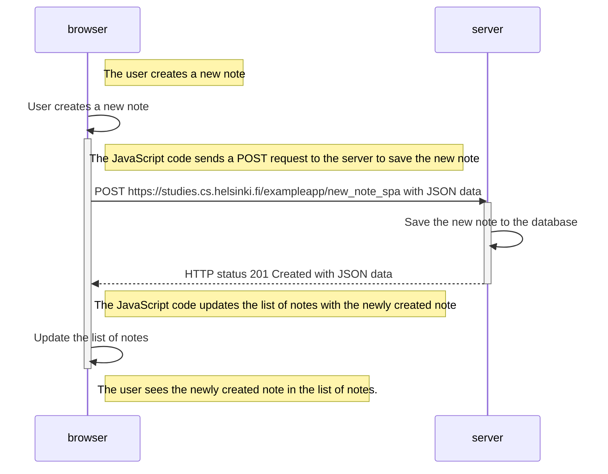

```mermaid
sequenceDiagram
    participant browser
    participant server

    Note right of browser: The user creates a new note

    browser->>browser: User creates a new note
    activate browser

    Note right of browser: The JavaScript code sends a POST request to the server to save the new note

    browser->>server: POST https://studies.cs.helsinki.fi/exampleapp/new_note_spa with JSON data
    activate server
    server->>server: Save the new note to the database
    server-->>browser: HTTP status 201 Created with JSON data
    deactivate server

    Note right of browser: The JavaScript code updates the list of notes with the newly created note

    browser->>browser: Update the list of notes
    deactivate browser

    Note right of browser: The user sees the newly created note in the list of notes.
```